:revealjs_customtheme: assets/tweeter-c-est-tooter.css
:revealjs_progress: true
:revealjs_slideNumber: true
:source-highlighter: highlightjs
:icons: font
:toc:

= Mastodon : quoi ? comment ?
:figure-caption!:

== _Tweetter_, c'est _tooter_ 

.Source : https://www.commitstrip.com/fr/
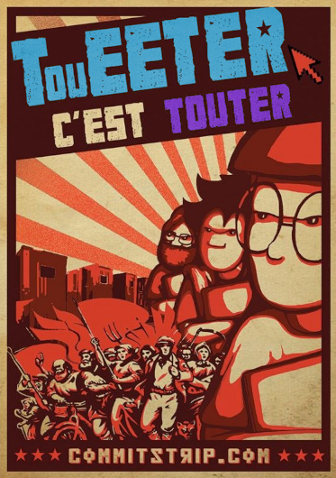
{empty} +

[.small]
Vendredi 17 février 2023 - Zenika Rennes

[.small]
Luc Sorel-Giffo : +++<del>+++@lucsorel+++</del>+++ @lucsorelgiffo@floss.social

[.notes]
--
Sources :
* https://www.commitstrip.com/fr/
--

[.columns]
=== Pourquoi me suis-je intéressé à Mastodon ?

[.column]
--
_Twitter fatigue_

.Source : https://xkcd.com/386/
image::assets/xkcd-386-duty_calls.png[fatigue,63%]

[.small]
Tonalité des échanges (facho- myso- climatosceptico- sphères)
--

[.column]
--
_Melon Suks_

.Source : https://twitter.com/elonmusk/status/1625377144137461761
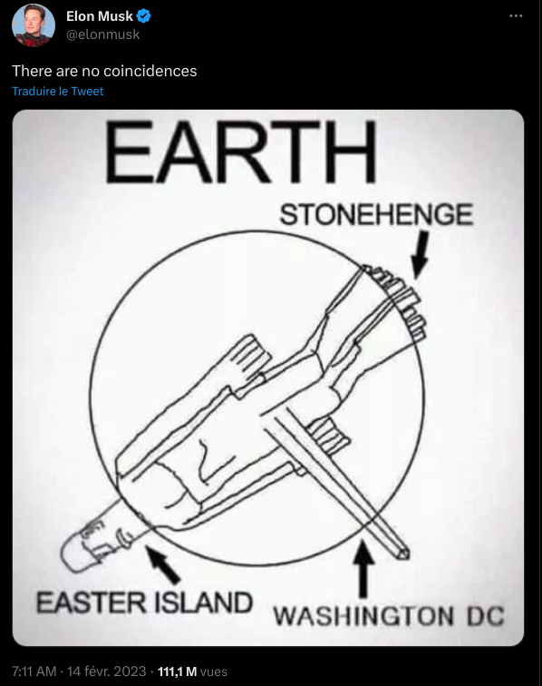

[.small]
Rachat et RH, verrouillage d'API, bidouillage des recommandations, etc.
--

[.columns]
== Qu'est-ce que Mastodon ?

[.column]
--
.Source : https://fr.wikipedia.org/wiki/Mastodon_(réseau_social)

--

[.column]
--
- un réseau social de micro-blogging
- décentralisé : plusieurs serveurs indépendants mais qui interagissent
- fédéré : s'articule avec d'autres services
--

=== Un moteur de micro-blogging

* https://github.com/mastodon/mastodon
* 40k+ ⭐, 750+ contributrices (février 2023)
* opensource : GNU Affero General Public License
* technologies :
** Ruby on Rails : API REST, pages web
** React.js + Redux : IHM interactive
** Node.js : API de streaming

[.columns]
=== Décentralisé (mais connecté) 1/2

[.column]
--
Chaque instance :

* a son hébergement et ses règles
* héberge ses comptes d'utilisation

.Source : https://youtube.com/watch?v=IPSbNdBmWKE&t=58
image::assets/Mastodon_instances.png[]
--

[.column]
--
* les personnes se suivent au-delà des instances
* les notifications et les flux d'info voyagent grâce à l'API unifiée

.Source : https://youtube.com/watch?v=IPSbNdBmWKE&t=82
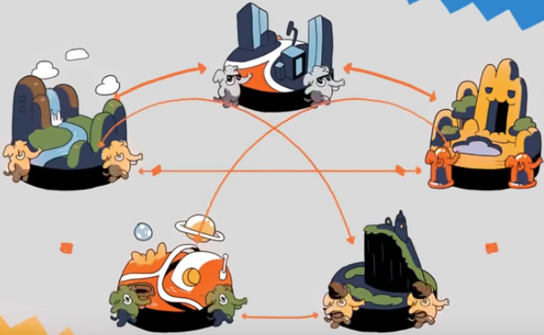
--

=== Décentralisé (mais connecté) 2/2

.Source : https://medium.com/@EthanZ/mastodon-is-big-in-japan-the-reason-why-is-uncomfortable-684c036498e5
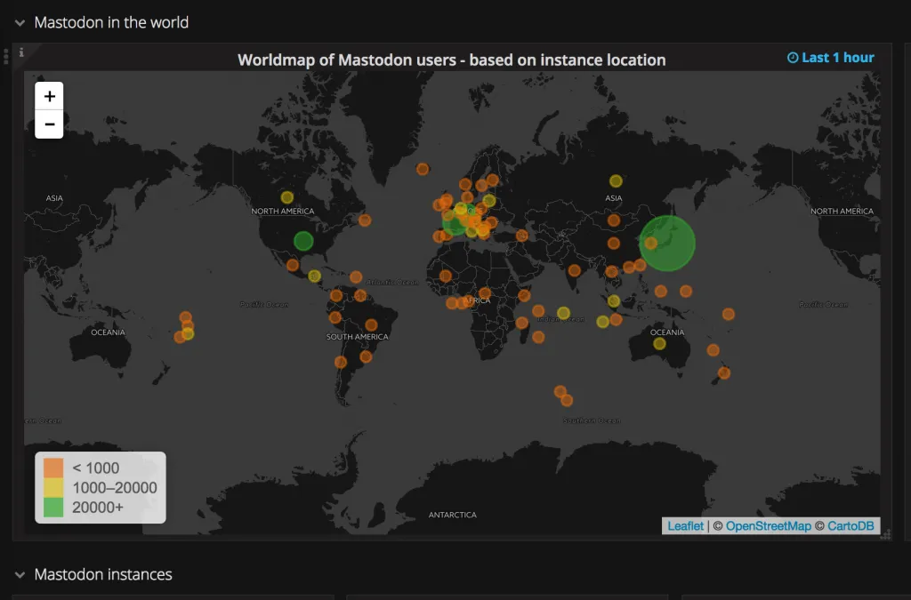

=== Fediverse = federated universe

.Source : https://techcrunch.com/2022/11/08/what-is-mastodon/
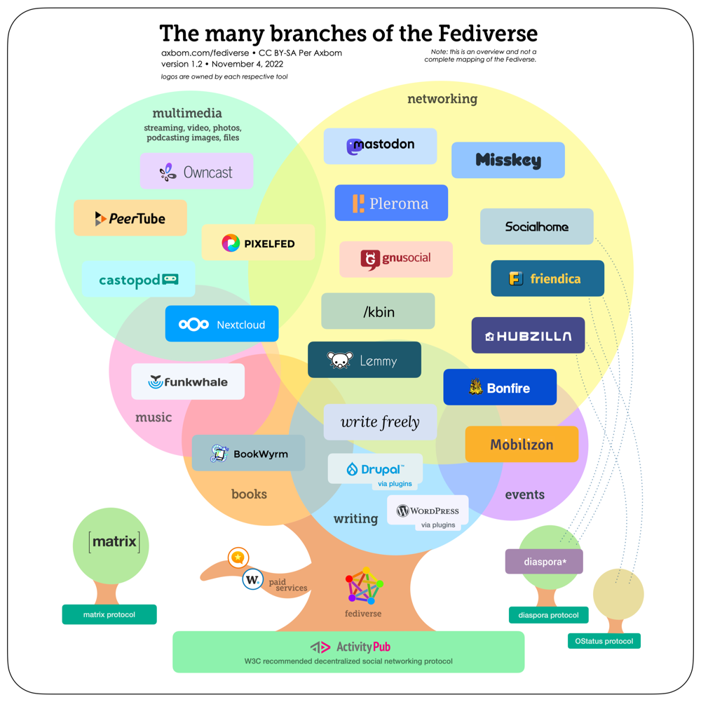

=== Interopérable

[plantuml, target=mindmap-diagram, format=svg]
----
@startmindmap
+[#lightblue] interopérable
-- client officiel
--- https://joinmastodon.org/
--- appli mobile
++ clients alternatifs
+++ https://semaphore.social/
+++ https://mastodeck.com/
++ API 
+++ https://docs.joinmastodon.org/methods/
@endmindmap
----

[.columns]
== Vocabulaire et fonctionnalités

[.column]
--
* tweet = toot (🇬🇧), pouet (🇫🇷)
* tweeter = tooter (🇬🇧 ?), poueter (🇫🇷)
* retweeter = booster
* hashtags = tags (même *#syntaxe*)
--

[.column]
--
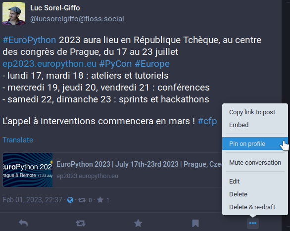
--

[.columns]
=== Rédiger un toot / pouet

[.column]
--
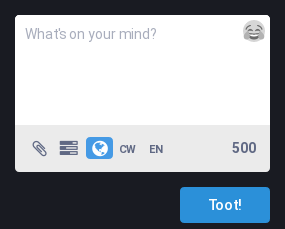

Images attachées :

* texte alternatif (lecteur audio)
* contenu sensible ?
--

[.column]
--
* 500 caractères
* emoji 👍✅
* langue
* accès au contenu
* contenu sensible ?
--

=== Éthique - gestion du contenu

.Source : https://www.allocine.fr/film/fichefilm_gen_cfilm=5280.html

* messages par ordre anti-chronologique sans filtrage algorithmique
* pas possible de commenter un pouet (évite la désinformation) :
** boost de contenu
** création de contenu original
* possible de masquer les boosts de personnes boostant beaucoup

=== Éthique - administration d'une instance

[plantuml, target=mindmap-diagram, format=svg]
----
@startmindmap
+[#lightblue] chaque instance
-- équipe d'administration
--- souvent bénévole
--- inscription / modération
++ liste d'inscription
++ besoins de financement
++ règles de fonctionnement
+++ accessible aux autres instances ?
+++ ouverture vers les autres instances ?
@endmindmap
----

== Choisir son instance 1/2

* un compte est rattaché à une instance
* possibilité de migrer son compte (on en reparle)
* possible de suivre des comptes sur d'autres instances
* outils pour choisir son instance :
** https://joinmastodon.org/servers
** https://instances.social/
* quelques exemples : piaille.fr, mstdn.social, floss.social, climatejustice.rocks, lgbtqia.space, urbanists.social, earthstream.social, union.place, etc.

=== Choisir son instance 2/2

Quelques comptes connus :

* https://toot.thoughtworks.com/@mfowler
* https://framapiaf.org/@nitot
* https://mamot.fr/@LaurentChemla
* https://fosstodon.org/@bzg
* https://framapiaf.org/@zwindler

[.columns]
=== Migrer son compte 1/2

[.column]
--
. compte créé ✅ : https://fosstodon.org/@lucsorelgiffo
. premier toot (🇬🇧) ✅
. premier pouet (🇫🇷) 😬 
--

[.column]
--
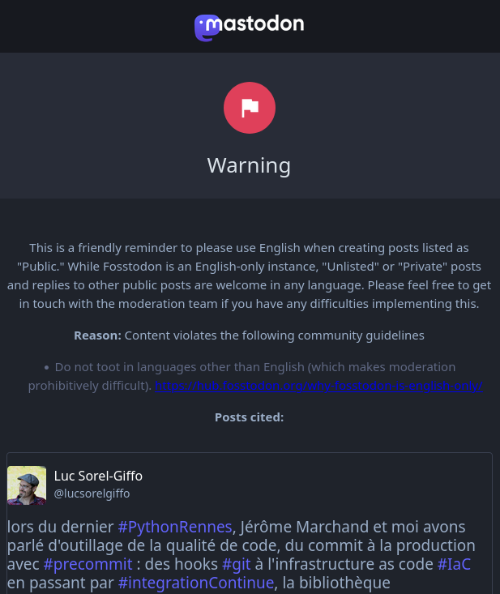
--

=== Migrer son compte 2/2

https://fosstodon.org/@lucsorelgiffo -> https://floss.social/@lucsorelgiffo

* mirroir de compte (puis désactivation, ou pas)
* migration automatique des suivant·es / suivi·es ✅
* pas de migration du contenu 😬 (risque d'inondation de l'instance)

[.columns]
=== Référencer son compte Mastodon depuis Github

[.column]
--
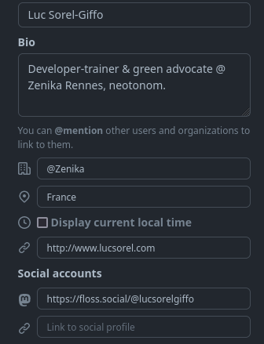
--

[.column]
--
[.small]
L'attribut `rel="me"` permet à Mastodon de valider l'association de votre compte Github :

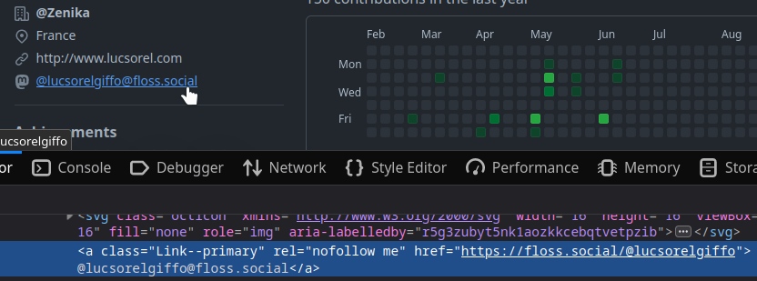

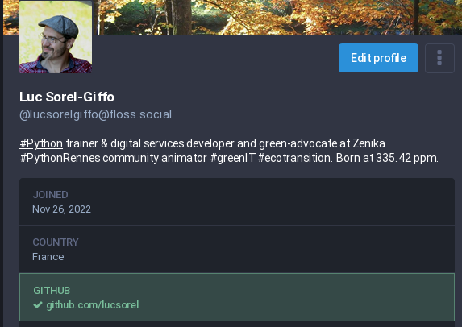
--

== En résumé

[plantuml, target=mindmap-diagram, format=svg]
----
@startmindmap
+[#lightblue] Mastodon
-- micro-blogging complet
--- compte perso
--- suivant·es / suivi·es
--- partage de médias
++ sain & résilient
+++ open-source
+++ décentralisé
+++ sans algo de recommandation
++ ⚠️ choix de l'instance
+++ 1. vos langues d'expression ?
+++ 2. vos thématiques ?
+++ 3. où sont les comptes qui vous inspire ?
+++ 4. ça n'est pas si grave que ça 🙂
@endmindmap
----

=== Pour en savoir plus

- slack Zenika : https://app.slack.com/client/T02ARLB3P/C04AMESDW0Y[#community-mastodon]

- récupérez vos données Twitter avant de partir : https://twitter.com/settings/download_your_data
- https://www.blogdumoderateur.com/comment-utiliser-mastodon-alternative-twitter/
- https://joachimesque.com/blog/un-guide-rapide-de-mastodon
- https://mastodon.help/
- https://www.youtube.com/watch?v=IPSbNdBmWKE (2:16 🇬🇧)
- https://www.youtube.com/watch?v=3PNatcybm1o (20:02 🇫🇷)

[.small]
🧌 Pour en savoir moins : https://twitter.com/elonmusk
